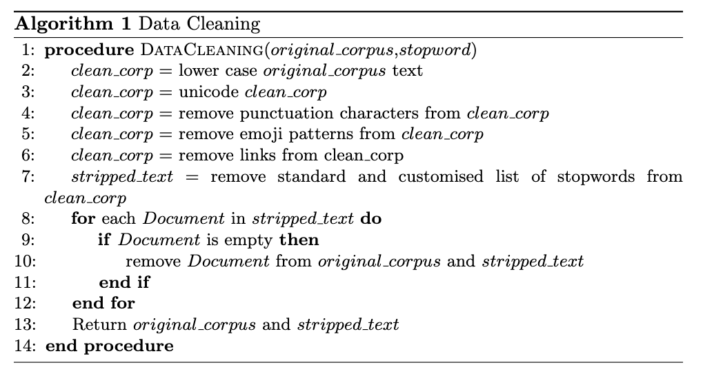
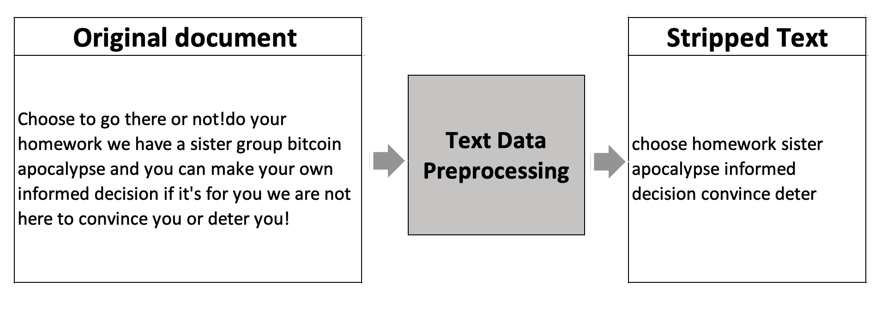
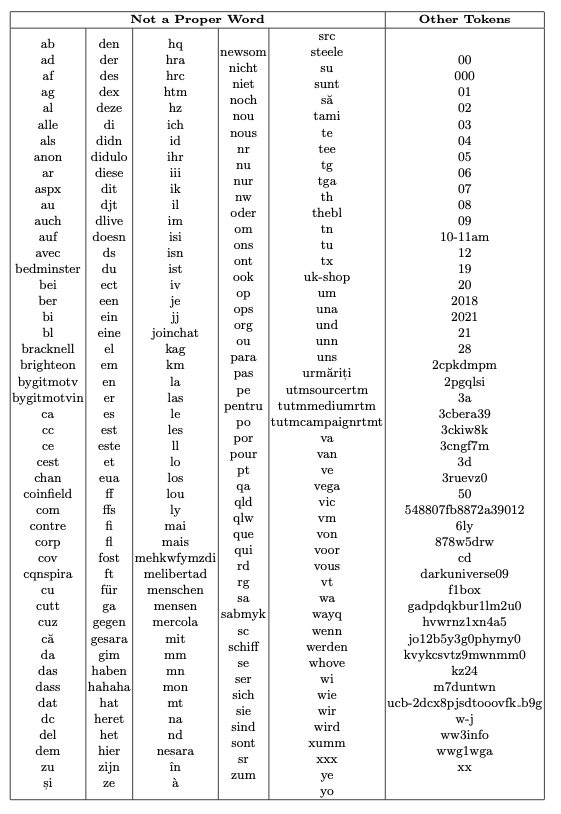
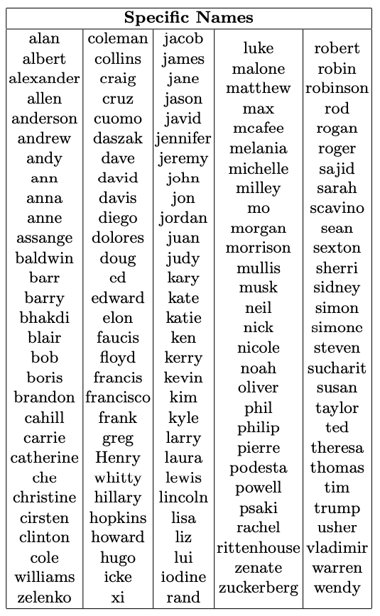
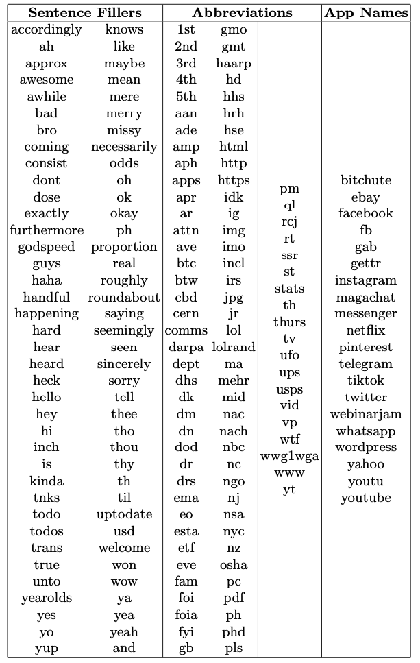
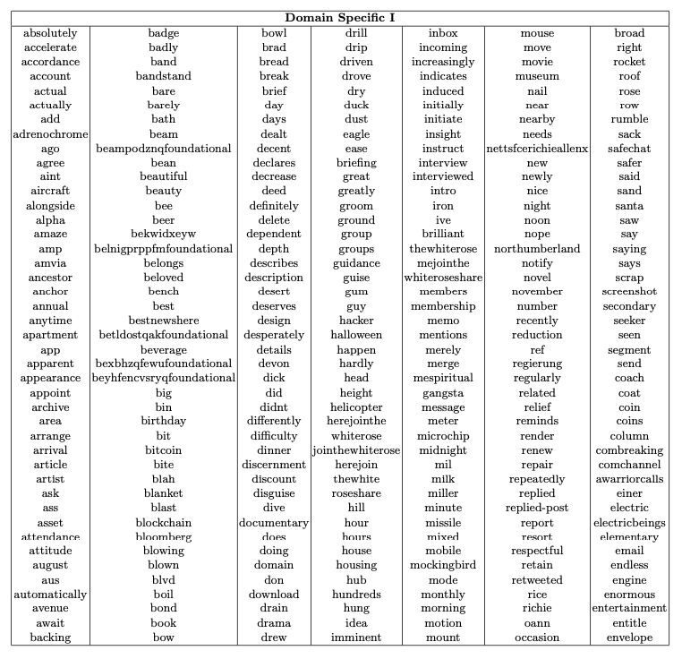
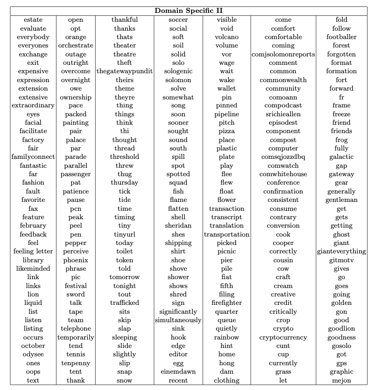
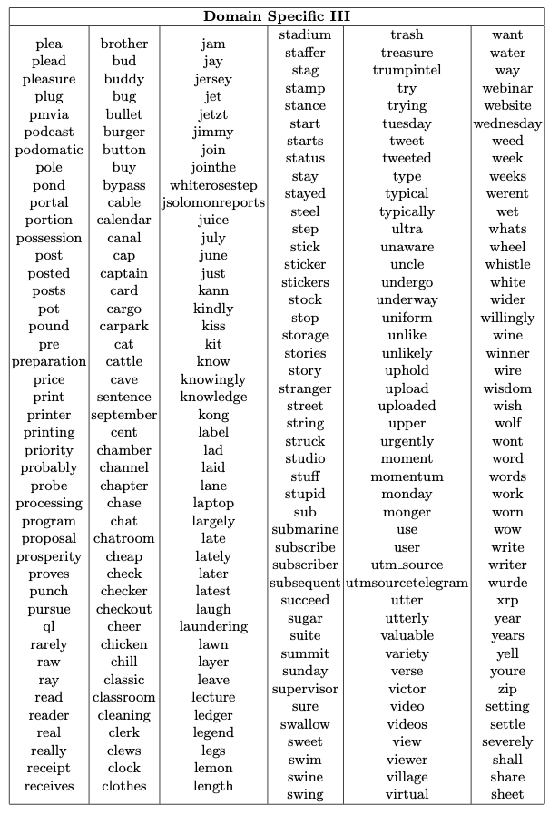

# Description

The original text corpus of our project is preprocessed using the script data_preprocessing.py. 

### ---------------------------------------------
### Reading Data
The script includes **ChannelData** class for reading the corpus from our database. 

There are two separate Tables for each channel of data in our dataset, 
  - These tables are read and appended in one as the orig text corpus. 
  - The object take list of target channel IDs. 

ChannelData class takes 4-args of:
  - datapath: string, pointing at '.db' file location 
  - list_6irish_channels,
  - target_table_1: str('Target Table_1'),
  - target_table_2: str('Target Table_2')):

Calling corpus() method returns:
  - TextCorpus = the original message content '''

### ---------------------------------------------
### Data Cleaning 

The data cleaning procedure includes the following steps:
<ol>
  <li>Lower case the text corpus.</li>
  <li>Removing a set of symbols and expressions : $\{\# \,\, n’t\,\,  !\,\,   @\,\,  \,\, ,  “\,\,   "\,\,  ’s\,\,  ()\,\,’ \,\, ? \,\, \}$.</li>
  <li>Removing one-digit and non-digit characters.</li>
  <li>Removng mail server and domain of the existing email addresses.</li>
  <li>Removing URLs.</li>
  <li>Removing the expression 'rt' if it happens at the beginning of a line.</li>
  <li>Duplication Removal.</li>
  <li>Lemmatization</li>
  <li>Stemming</li>
</ol>
The preprocessed data is stored as stripped text in database. 

The pseudocode of preprocessing is presented herein: 

<figure>

  
  <figcaption>The pseudocode of text preprocessing. </figcaption>
  

</figure>

The following text example presents an example of original message content and stripped text; the test sample is taken from Telegram channel V) Anti-Lockdown Ireland.

<figure>

  
  <figcaption>Sample of data preprocessing from Telegram channel V) Anti-Lockdown Ireland. </figcaption>
  

</figure>

The customized list of stop-words can be found in 'stopwords.txt' file; The categorized list of stopwords is presented in the following tables: 
<figure>

  
  

</figure>

<figure>

  
  

</figure>

<figure>

  
  

</figure>
<figure>

  
  

</figure>
<figure>

  
  

</figure>
<figure>

  
  

</figure>

### ---------------------------------------------
### How to Use the data_preprocessing.py  

- The script is written to read data from our database using the ChannelData class. 
- Creating DataCleaning object and calling lemma_stem() stores clean corpus in the user-defined table. 
 
