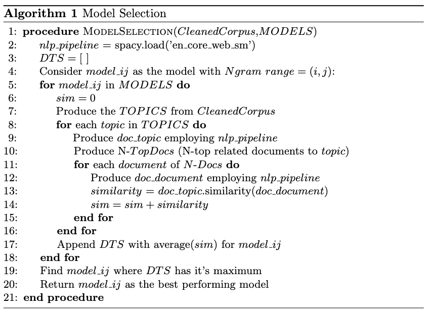
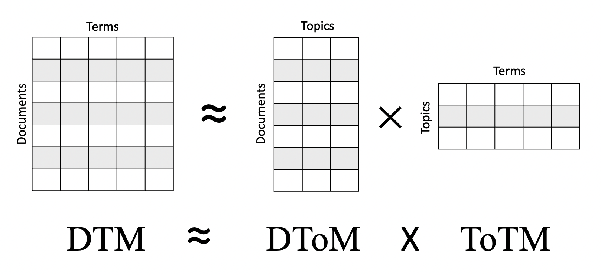

# Description
This folder includes 'model_selection.py' script which encompasses two main functions:
- The algorithm for producing different topic models 
- Selecting the best performing model based on document topic similarity 

The Pseudocode of proposed model selection algorithm is presented in Algorith 1:

<figure>

  
  

</figure>

### ------------------------------------------------------------------------------------------
## Class: DocTopicSim 
This class includes data attribute references and 6-methods as follows:
INPUT:
    The input for the class requires:
                    - orig_msg_content
                    - strip_text
                    - max_ngram_range
                    - StopWords text file
                    - Number of topics: ntopics
                    - Number of terms per topic: nterms
                    - Number of relevant documents to be assigned from each extracted topic: ndocs

### - Data Attribute References:
- doc_terms_lda  = []
- doc_terms_nmf  = []

- df_lda  = pd.DataFrame()
- df_nmf  = pd.DataFrame()
- df_ntm  = pd.DataFrame()
    
- dfp_lda  = pd.DataFrame()
- dfp_nmf  = pd.DataFrame()
- dfp_ntm  = pd.DataFrame()
- rs_ntm   = []
- avg_sims_ntm = []
    
- all_doc_targets_lda = pd.DataFrame()
- all_doc_targets_nmf = pd.DataFrame()
- all_doc_targets_ntm = pd.DataFrame()

### - Methods
#### 1. def \_\_init\_\_()
The initialization method for the class where the following instanc es of classes are initiated:
- channel name
- original corpus
- stipped text(cleaned corpus)
- the targets (if available) 
- max N-gram range
- desired number of topics & terms & docs
- length of corpus (number of documents in corpus) 

#### 2. def lda_doc_topic_sim()
The function produces LDA topic models using CountVectorizer which is parameterized with max_df = 0.9, min_df = 1, max_features = 2000 and various ngram_ranges. The varius ngram_ranges are generated automatically using max_ngram_range. The prametrized CountVectorizer is then fitted with stripped_text (clened_corp) and yieled the vectorized matrix of the corpus which will be fitted in LatentDirichletAllocation module. 10-topics are produced and 3-corresponding documnets for each topic are determined for measuring the document similarity index. 

graph TD;
  Topic 0 --> Doc_i
  Topic 0 --> Doc_j
  Topic 0 --> Doc_k

  Topic 1 --> Doc_l
  Topic 1 --> Doc_i
  Topic 1 --> Doc_m

  .
  .
  . 

  Topic 9 --> Doc_j
  Topic 9 --> Doc_f
  Topic 9 --> Doc_p

The similarities are measured by creating NLP documents from the topic and corresponding doc, then find the similarity between the pair.   
Averaging over all calculted similarities, storing the results for each LDA $model_ij$ with ngram_range = (i , j).
Plotting the barchart for average similarities of experimented models. 

#### 3. def nmf_doc_topic_sim()

Non-Negative Matrix Factorization (NMF) is a state of the art feature extraction algorithm which would produce meaning patterns, topics and themes if it is provided by content attributes. Statistical NMF model learns topics by decomposing the DTM. The outcome of decomposition is two low-rank factor matrices of Document Topic feature Matrix (DToM) and Topic Term feature Matrix (ToTM), see the following figure. Topic and document clusters were then extracted from their corresponding feature matrices.

<figure>

  
  

</figure>

The function produces NMF topic models using TF-IDF-Vectorizer. 

The module employs TF-IDF text information retrieval method for extracting the topics. TF-IDF was evolved in early 1970s as the outcome of two major research by [[1]](#1) and [[2]](#2). In 1991 authors of [[3]](#3), employed TF-IDF as an automatic text indexing approach for text retrieval. Since then, the approach has been widespreadly used for topic modeling, document classification, stop-word filtering and sentiment analysis. 

The TF-IDF-Vectorizer is parameterized with max_df = 0.9, min_df = 1, max_features = 2000 and various ngram_ranges. The varius ngram_ranges are generated automatically using max_ngram_range. The prametrized CountVectorizer is then fitted with stripped_text (clened_corp) and yieled the vectorized matrix of the corpus which will be fitted in NMF module. setting the initialization of NMF module to "Nonnegative Double Singular Value Decomposition (NNDSVD) initialization", 10-topics are produced and 5-corresponding documnets for each topic are determined for measuring the document similarity index.

The similarities are measured by creating NLP documents (using spaCy module) from the topic and corresponding doc, then find the similarity between the pair.   
Averaging over all calculted similarities, storing the results for each NMF $model_ij$ with ngram_range = (i , j).
Plotting the barchart for average similarities of experimented models. 

#### 4. def ntm_doc_topic_sim()
Two different NTM were produced using Contextualized Embeddings and generated for two versions:
  (I)  CombinedTM
  (II) ZeroShotTM

The CombinedTM model employed sentence transformer of "all-mpnet-base-v2". The transformer maps sentences and paragraphs to a 768 dimensional dense vector space. The defined sentence transformer is then fitted on original corpus for building the contextulized content and the stripped text (cleaned_corp) for building the bag-of words. 
The model is trained using "Latent Dirichlet Allocation with Product of Experts (ProdLDA)" model type. 10 topics are produced and for each topic 5-top corresponding documents are identified, then the similarities between the pair of topic and document are measured by creating NLP documents and NLP similarity measure (using spaCy module). 

The ZeroShotTM model employed sentence transformer of "all-mpnet-base-v2". The transformer maps sentences and paragraphs to a 768 dimensional dense vector space. The defined sentence transformer is then fitted on original corpus for building the contextulized content and the stripped text (cleaned_corp) for building the bag-of words.

#### 5. def save_Top_Doc()
Getting the target model (different ngram-ranges / combinedTM/ZeroShot) and the desired mode (LDA/ NMF/ NTM) as the input, the method will save the topics and documents for further investigation.

#### 6. def plot_DTS_RS()
This method will scatter plot the DTS_RS for all the produced models. 

### ---------------------------------------------
## References
<a id="1">[1]</a> 
Luhn, H.P. 
The automatic creation of literature abstracts. 
IBM Journal of research and development 2(2), 159–165 (1958).

<a id="2">[2]</a> 
Jones, K.S.: Index term weighting. Information storage and retrieval 9(11), 619–
633 (1973).

<a id="3">[3]</a> 
Salton, G.: Developments in automatic text retrieval. science 253(5023), 974–980 (1991). 

<a id="4">[4]</a> 
Harris, Z.S.: Distributional structure. Word 10(2-3), 146–162 (1954)

<a id="5">[5]</a> 
Wolf, F., Gibson, E.: Representing discourse coherence: A corpus-based study.
Computational linguistics 31(2), 249–287 (2005)

<a id="6">[6]</a> 
amberg, B.: What makes a text coherent? College composition and communica-
tion 34(4), 417–429 (1983)