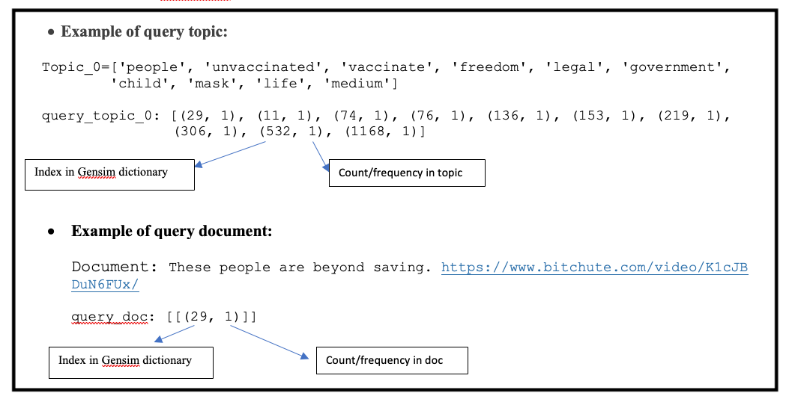
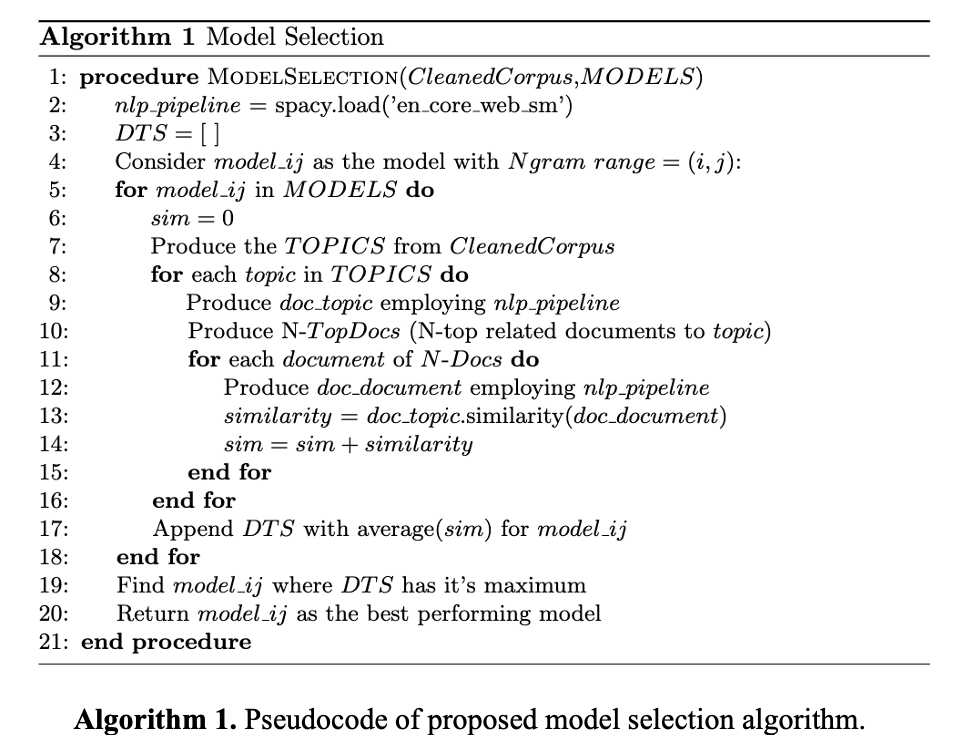

# Description
This folder includes 'model_selection.py' script which encompasses two main functions:
- The algorithm for producing different topic models 
- Selecting the best performing model based on document topic similarity 

### ------------------------------------------------------------------------------------------
## Topic Modeling Models
The module employs TF-IDF text information retrieval method for extracting the topics. TF-IDF was evolved in early 1970s as the outcome of two major research by [[1]](#1) and [[2]](#2). In 1991 authors of [[3]](#3), employed TF-IDF as an automatic text indexing approach for text retrieval. Since then, the approach has been widespreadly used for topic modeling, document classification, stop-word filtering and sentiment analysis. 

Topic modeling with TF-IDF approach includes 
- (I) identifying individual word occurrences in documents of a collection,
- (II) deleting the high-frequency function words using stop-words list,
- (III) suffix stripping and stemming words,
- (IV) assigning weight factor $w_{ik}$ for each term $T_{k}$ in document $D_{i}$ to indicate the term importance and
- (V) presenting each document $D_{i}$ by a set or vector of weighted word stems.  

Term frequency of a text corpus is indicated by $tf_{t,d}$ which presents the occurrence of token $t$ in a document $d$. The term frequency implies that the more times the token $t$ appears in document $d$, the more likely this token belongs to the representative topic of the document $d$. Document frequency of the text corpus is indicated by $df_{t}$ which presents the occurrence of token $t$ throughout all documents. The document frequency implies that the more versatile token $t$ is in the corpus, the less distinctive the token would be between documents.

For a given document the term frequency ($tf$) and the inverse of document frequency ($idf$) are multiplied for each token $t$ and converted to weights. In order to reduce the relative importance of the increases in weights for larger values, the logarithm of $idf$ is taken. The weights formula can be written as the following Equation where $N$ is the length of documents in corpus. 

$$
w(t,d) = tf_{t,d} \,\, log(\left |N \right |/df_{t})
$$

Bag of Words (BoW) is a representation tool in NLP and thrives to model a document as the bags of it's words. The very early references of BoW in linguistic context was published in 1954 [[4]](#4). BoW would be created by iterating over documents and are conveying frequency of each term as training feature representation. The term frequencies are normalized by means of dividing the word count of specific term by the number of unique tokens. In this work, the $tf$ and $idf$ are produced using $tfidf-vectorizer$ from Scikit-Learn Python module. The vectorizer is then fitted by the desired input corpus (stripped text data) to produce Data Term Matrix (DTM) of the targeted corpus documents.

Non-Negative Matrix Factorization (NMF) is a state of the art feature extraction algorithm which would produce meaning patterns, topics and themes if it is provided by content attributes. Statistical NMF model learns topics by decomposing the DTM. The outcome of decomposition is two low-rank factor matrices of Document Topic feature Matrix (DToM) and Topic Term feature Matrix (ToTM), see the following figure. Topic and document clusters were then extracted from their corresponding feature matrices.

<figure>

  
  

</figure>

In this research, NMF is built using NMF object from Scikit-Learn decomposition module in Python. The object is built for user specified number of topics and Non-negative Double Singular Value Decomposition (NNDSVD) initialization. The decomposing object is then fitted on corpus $DTM$ which produces the topics, their corresponding documents and terms.

Different topic models were produced using various Ngram-Ranges. The software allows the user to input the M = Max-Ngram-Range they desire. According to M = Max-Ngram-Range  

<figure>

  
  

</figure>

The topic models were produced employing different Ngram-range models. to choose the best performing model, a quantitative topic model analysis is proposed and detailed in the following subsection.   

### ------------------------------------------------------------------------------------------
## Model Selection 
The challenge is to identify a model in which topics and documents are well coherent; so the topic model conveys a clear communication purpose and meaning to the reader [[5]](#5). Moreover, the coherence will represent text integration as a whole [[6]](#6). 

Would topic modeling be considered as an unsupervised clustering algorithm, the problem of quantitative evaluation could be translated into internal clustering validation. The study herein measures Distance Weighted Cosine Similarity (DWCS) between extracted topics and their most relevant documents in N-dimensional Vector Space Model (VSM). 

For the ease of visualization, let Cosine similarity property to be the inverse of distance; the shorter the distance, the higher similarity. Having this visualization concept in mind, The following Figure represents similarity of projected topics and their three relevant documents in 2-D. 

The closer (higher cosine similarity) the topic and it's most relevant documents are, the higher similarity and coherence exists in topic models; hence a more efficient model is returned. The following Figure represent two models; which (a) Model\_I extracted more coherent topics comparing to (b) Model\_II. 

<figure>

  
  

</figure>

Queries are vector constructs built upon common dictionary of tokens from a single topic or document. As the query vector is derived from common dictionary it inherits the tokens IDs from common dictionary and maps it to count/ frequency of token in the text (topic/ document). 

Examples of query\_topic and query\_document from our database can be found in the following Figure. The query frequencies define the weight of vectors, where it's indices play a roll in determining VSM dimension. 

<figure>

  
  

</figure>

Topic models' coherence is reported while document topic similarities are averaged over all pairs of query\_topic and query\_document of the investigated model. 

Each model's similarity index is then stored in the data frame for further comparison and plotting purposes. 

The models with highest and lowest similarity indexes are returned.

The algorithm for Model Selection of is presented in the following. 

<figure>

  
  

</figure>

### ------------------------------------------------------------------------------------------
## The Script:  _model_selection.py_

DocTopicSim class is created to perform major topic modeling experiments as follows:

- Topic Models for a different range of n-grams are produced,

- N-Top-Related-Documents for each extracted topic is determined,

- The similarity between each pair of "N-Top-Related-Document" and "Corresponding-Topic" is calculated

- The tfidf_doc_topic_sim() method returns a descriptive DataFrame of corpus include columns = ['Model', 'Num_Topics', 'Extracted_Topics', 'Relevant_Docs', 'Strip_text_of_doc', 'Doc_Topic_Similarity'] 

- The average Ndoc-topic similarity for each experimented model is plotted. 
        

INPUT:
> The input for the class requires:
  - orig_msg_content
  - strip_text
  - ngram_range
  - StopWords text file
  - Number of topics: ntopics
  - Number of terms per topic: nterms
  - Number of relevant documnets to be assigned from each extracted topic: ndocs

OUTPUT:
> Calling tfidf_doc_topic_sim() function on DocTopicSim-class-object will store a DataFrame in class.df variable which includes the following content in columns: 
  - 'Model'
  - Num_Topics'
  - 'Extracted_Topics'
  - 'Relevant_Docs'
  - 'Strip_text_of_doc'
  - 'Doc_Topic_Similarity'
                                                                                
> Calling plot_similarity_for_models() function on DocTopicSim-class-object which is trained using tfidf_doc_topic_sim() will plot the average similarity which is achieved for each trained model.  

### ---------------------------------------------
## References
<a id="1">[1]</a> 
Luhn, H.P. 
The automatic creation of literature abstracts. 
IBM Journal of research and development 2(2), 159–165 (1958).

<a id="2">[2]</a> 
Jones, K.S.: Index term weighting. Information storage and retrieval 9(11), 619–
633 (1973).

<a id="3">[3]</a> 
Salton, G.: Developments in automatic text retrieval. science 253(5023), 974–980 (1991). 

<a id="4">[4]</a> 
Harris, Z.S.: Distributional structure. Word 10(2-3), 146–162 (1954)

<a id="5">[5]</a> 
Wolf, F., Gibson, E.: Representing discourse coherence: A corpus-based study.
Computational linguistics 31(2), 249–287 (2005)

<a id="6">[6]</a> 
amberg, B.: What makes a text coherent? College composition and communica-
tion 34(4), 417–429 (1983)